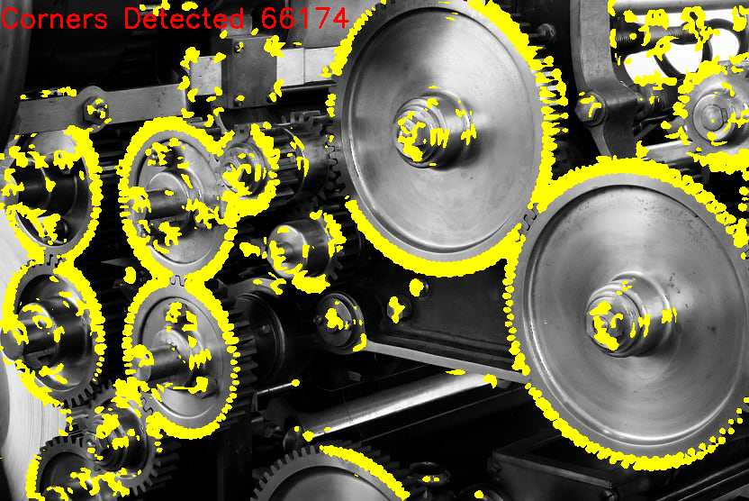
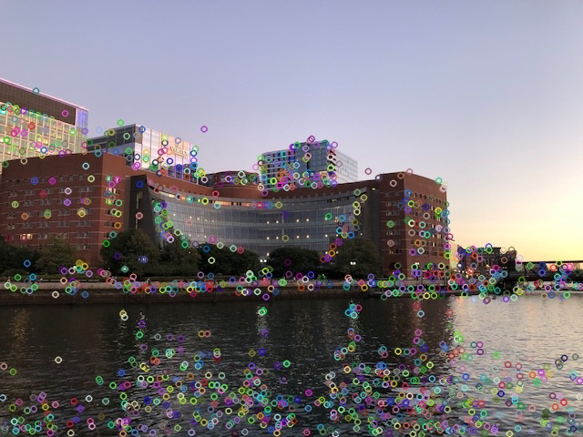
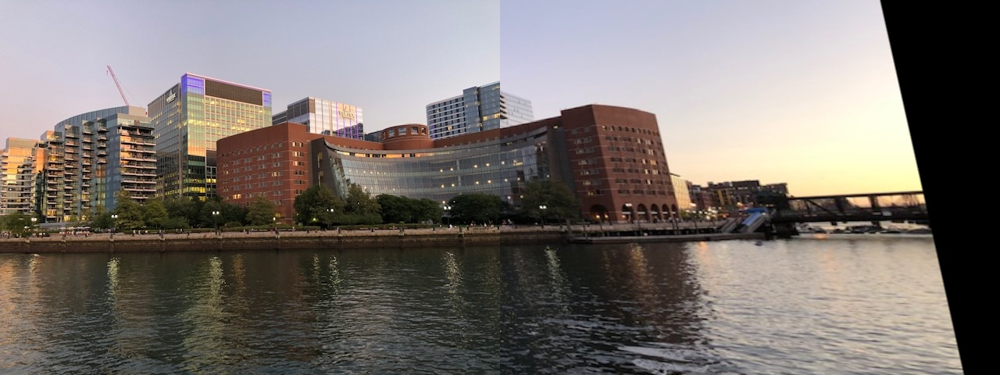

  
  
    

# Harris Corner Detector Algorithm
## Introduction
The Harris Corner Detector algorithm was applied to a picture. A brief overview of the steps involved in this algorithm is given below:  
→ First the input image was read and was converted from RGB to Gray.  
→ Gaussian filter was applied with a 9x9 kernel and sigmax/sigmay of 3.  
→ X and Y gradients were computed using the sobel filter with kernel size of 9x9.  
→ The components of the matrix M were calculated. These component are Ix^2, Iy^2, and IxIy.  
→ The corner response function is calculated.  
→ The last step of the algorithm is the execution of non-maximum suppression. This is the step were had to empirically choose a threshold value above which a corner is detected.  

OpenCV libraries were used throughout the code. Lastly, a corner count is displayed on the image.  
The output file from running the Harris Code Detector is shown below:  
  

## Keypoint and Descriptor Generator for Image Stitching
The steps involved in stitching were the following:  
→ First step is the input of an image and converting that image from RGB to GRAY.  
→ The second step computes the descriptors and keypoints on both images using SIFT. 
→ The third step uses the FLANN method for matching the most similar descriptors from both images.  
→ The next step applied is filtering of only the best matches with shorted distance ratio.  
→ Next, RANSAC is run and estimated homography is computed and image alignment performed.  
→ The last step of this code is image wrapping and the stitching of the images.  

The image below depicts the SIFT keypoints on an image.  
  

The image below depicts the stitching product on two images:  
  

## Harris Corner Detection On Video
I took a video with my webcam and applied the Harris Corner Detector per frame. The same steps are applicable to this code as they were for the Harris Corner Detector. The only difference here is that we capture webcam frame by frame. We apply the Harris Corner Detector on each frame and we also display the corner count and the corners themselves for each frame on the video. We record a video using webcam at 30 fps and then we output a video with the Harris Corners and the count at 10 fps.  

A video of this can be found [*here*](https://github.com/abedinsherifi/Harris-Corner-Detector/blob/main/images/Harris_Corner_Detection_Video.mp4).  

https://abedinsherifi.github.io/Harris-Corner-Detector/
